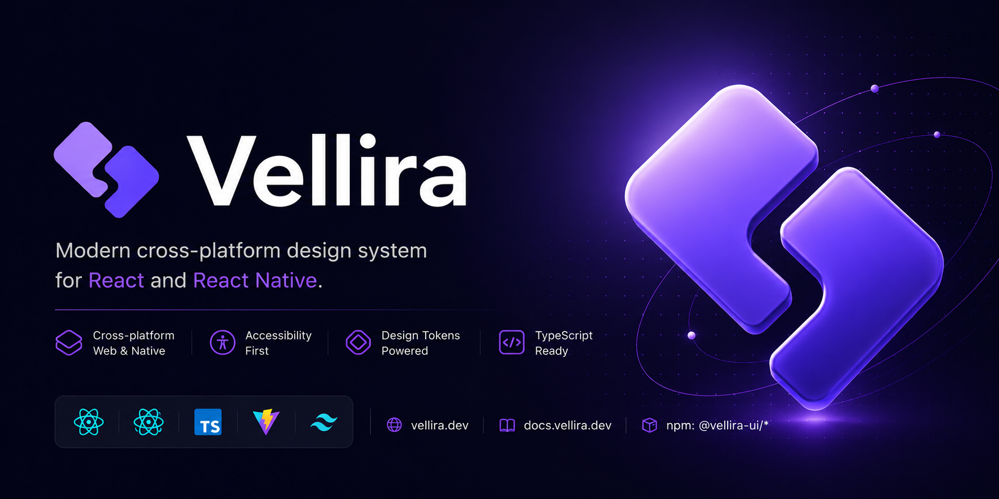

<p align="center">
  
</p>

# Vellira

Modern cross-platform design system
for React and React Native.

Accessible • TypeScript • Tree-shakeable • Production Ready

Build accessible applications faster with production-ready components,
design tokens, icons and developer tooling.

[](https://www.npmjs.com/package/@vellira-ui/react)
[](https://www.npmjs.com/package/@vellira-ui/react)
[](https://github.com/vellira-dev/vellira/blob/main/LICENSE)
[](https://github.com/vellira-dev/vellira/actions/workflows/ci.yml)
[](https://github.com/vellira-dev/vellira/actions/workflows/chromatic.yml)
[](https://docs.vellira.dev)


**Website:** https://vellira.dev •  **Docs:** https://docs.vellira.dev •  **npm:** https://www.npmjs.com/org/vellira-ui

## React

Production-ready components.

## React Native

Native-first component library.

## Design Tokens

Shared tokens for Web and Native.

## Documentation

Interactive documentation powered by VitePress.

## Packages

| Package                           | Description             |
|-----------------------------------|-------------------------|
| [`@vellira-ui/react`](...)        | React components        |
| [`@vellira-ui/react-native`](...) | React Native components |
| [`@vellira-ui/core     `](...)    | Shared hooks and logic  |
| [`@vellira-ui/tokens      `](...) | Design tokens           |
| [`@vellira-ui/icons   `](...)     | Icon library            |
| [`@vellira-ui/types    `](...)    | Shared TypeScript types |

## Installation

```bash
pnpm add @vellira-ui/react
```

```tsx
import { Button } from '@vellira-ui/react';

<Button>Click me</Button>
```

## Features

- ✅ React & React Native
- ✅ Fully typed with TypeScript
- ✅ Accessible components
- ✅ Design Tokens
- ✅ Dark & Light themes
- ✅ Tree-shakeable packages
- ✅ SSR compatible
- ✅ Storybook
- ✅ MIT License

## Links

- [Documentation](https://docs.vellira.dev)
- [GitHub Repository](https://github.com/romanbakurov/Vellira)
- [Storybook Demo](https://main--6a07269cf7126a71ef2f62ca.chromatic.com)
- [Chromatic Library](https://www.chromatic.com/library?appId=6a07269cf7126a71ef2f62ca&branch=main)
